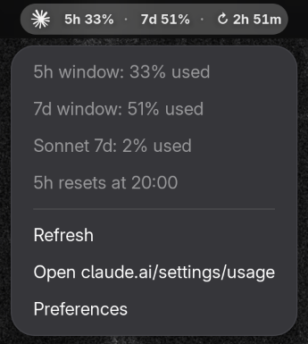

<p align="center">
  
</p>

<h1 align="center">Claude Usage</h1>

<p align="center">
  <strong>Monitor your Claude AI usage limits right from the GNOME top bar</strong>
</p>

<p align="center">
  <a href="https://extensions.gnome.org/"></a>
  <a href="LICENSE"></a>
</p>

<p align="center">
  
</p>

---

## Features

- **5-hour window** — short-term rate limit utilization
- **7-day window** — weekly rolling limit utilization
- **Reset countdown** — time remaining until your 5-hour quota resets
- **Color-coded labels** — white (normal) / yellow (>60%) / orange (>80%) / red (>90%)
- **Dropdown details** — Sonnet usage, exact reset time, quick link to claude.ai
- **Auto-detect credentials** — reads your OAuth token from Claude Code automatically
- **Configurable** — refresh interval, panel position, manual token override

## Installation

### From source

```bash
git clone https://github.com/stfnRO/gnome-shell-extension-claude-usage.git
cd gnome-shell-extension-claude-usage
bash install.sh
```

Then restart GNOME Shell (log out/in on Wayland, or `Alt+F2` → `r` on X11) and enable:

```bash
gnome-extensions enable claude-usage@tasta.space
```

## Authentication

### Automatic (recommended)

If you have [Claude Code](https://docs.anthropic.com/en/docs/claude-code) installed and logged in, the extension reads your token from `~/.claude/.credentials.json` automatically. No setup needed.

### Manual

1. Open [claude.ai](https://claude.ai) and log in
2. DevTools (`F12`) → Application → Cookies → `claude.ai`
3. Copy the `sessionKey` cookie value (starts with `sk-ant-`)
4. Paste it in extension preferences → "Manual token"

```bash
gnome-extensions prefs claude-usage@tasta.space
```

## How it works

The extension polls the Anthropic OAuth usage API at a configurable interval (default: 3 minutes):

| Metric | Description |
| --- | --- |
| `five_hour` | Short-term rate limit (resets every 5 hours) |
| `seven_day` | Weekly rolling rate limit |
| `seven_day_sonnet` | Separate Sonnet model limit (shown if available) |

## Development

| Task | Command |
| --- | --- |
| Enable | `gnome-extensions enable claude-usage@tasta.space` |
| Disable | `gnome-extensions disable claude-usage@tasta.space` |
| Preferences | `gnome-extensions prefs claude-usage@tasta.space` |
| View logs | `journalctl /usr/bin/gnome-shell -f \| grep "Claude Usage"` |
| Compile schemas | `glib-compile-schemas --strict schemas/` |

## Disclaimer

Not affiliated with or endorsed by Anthropic. Usage data is obtained from the Anthropic API. No warranty expressed or implied.

## License

[MIT](LICENSE)
